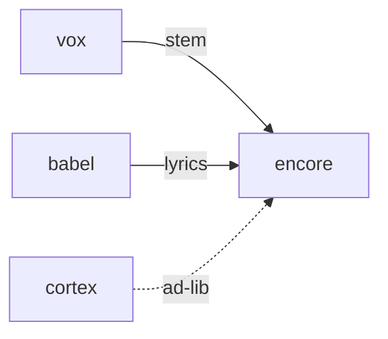

# Encore

**Pet Karaoke Jam** — A planned karaoke game for matching a pet melody with voice or tap keys.

Part of [ComputerPets](https://github.com/RicheyWorks/computerpets). Map: [computerpets-ecosystem](https://github.com/RicheyWorks/computerpets-ecosystem).

[Status](#status) · [Design](docs/DESIGN.md) · [Contributor start](#contributor-start) · [Ecosystem](https://github.com/RicheyWorks/computerpets-ecosystem)

| Project | At a glance |
| --- | --- |
| Status | Design scaffold; not runnable yet |
| License | MIT |
| Tokens | Minigames never mint or burn. Tired overlay, not a dead lineage. |
| First pet | [Flagship start guide](https://github.com/RicheyWorks/computerpets/blob/main/docs/START-HERE.md) |

## Status

This repository contains a [design](docs/DESIGN.md) and a [source placeholder](src/index.ts). It has no runnable application, build manifest, automated tests, or CI workflow.

The experience, interfaces, integrations, and safeguards below are **implementation plans**, not supported features. The first implementation slice defines the initial contribution target.

## Planned experience

Vox is the synth. Encore is the game: you match Rui's line. Scoring is pitch + timing, not 'are you a good singer forever'. Babel supplies lyrics.

## Intended audience

Mic-optional karaoke. Vox is the reference stem.

## Out of scope

A talent show that stores your voice. Mic upload is opt-in.

## Planned genre and engine

- Genre: **Music pitch-match**
- Engine: **React / Web Audio**
- Stack: TypeScript · React 19 · Web Audio API · Vox reference stems · pitch detector
- Proposed surface: `8080`

## Proposed integration



## Proposed play loop

1. Pick a Lore lullaby or Cortex-safe line.
2. Pet sings reference (Vox).
3. You match. Score → treat.
4. Twitch later: audience picks the song.

## First implementation slice

Initial implementation target:

**One lullaby, Vox reference, pitch score, tap-keys if no mic.**

Acceptance targets: No mic: tap keys. Vox down: MIDI beep. Raw mic never uploaded by default.

## Planned environment

Node 22, mic permission optional

## Planned safeguards

Mic permission denied → practice with tap keys. Vox down → MIDI beep reference. Never upload raw mic without opt-in.

Design constraints:

- 210 living kinds. No illegal hybrids.
- Overlay pets can get tired, sick, or hide. Tokens are not burned by a minigame.
- Desktop walk stays the main quest. Closing Encore must leave Rui walking.

## Related projects

- [computerpets-vox](https://github.com/RicheyWorks/computerpets-vox)
- [computerpets-cadence](https://github.com/RicheyWorks/computerpets-cadence)
- [computerpets-babel](https://github.com/RicheyWorks/computerpets-babel)
- [computerpets-cortex](https://github.com/RicheyWorks/computerpets-cortex) (optional ad-lib)

## Layout

```
computerpets-encore/
  README.md
  LICENSE
  docs/DESIGN.md
  src/                implementation lands here
```

## Contributor start

With Git and PowerShell, clone the scaffold and read its design and source marker:

```powershell
git clone https://github.com/RicheyWorks/computerpets-encore.git
Set-Location computerpets-encore
Get-Content .\docs\DESIGN.md
Get-Content .\src\index.ts
```

Start with the [first implementation slice](#first-implementation-slice). Add the minimum project setup and tests needed for that slice, then document verified run commands. The proposed stack above is a design choice; there is no install or launch command for this checkout yet.

## Links

- Flagship: [RicheyWorks/computerpets](https://github.com/RicheyWorks/computerpets)
- This repo: [RicheyWorks/computerpets-encore](https://github.com/RicheyWorks/computerpets-encore)
- Map: [RicheyWorks/computerpets-ecosystem](https://github.com/RicheyWorks/computerpets-ecosystem)
- Design file: [docs/DESIGN.md](docs/DESIGN.md)

## License

MIT. See [LICENSE](LICENSE).

---

*Two hundred ten living kinds. Keep them so a line does not go quiet.*
