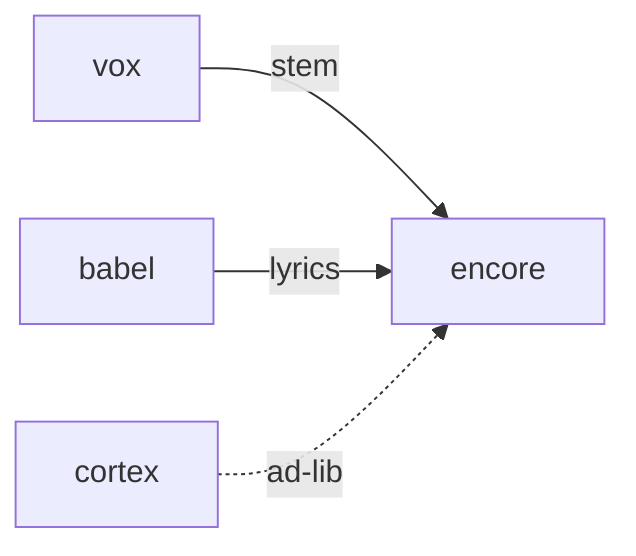

# Encore

**Pet Karaoke Jam** — Pitch-matching karaoke that sings along with Vox pet voices.

Part of [ComputerPets](https://github.com/RicheyWorks/computerpets). Map: [computerpets-ecosystem](https://github.com/RicheyWorks/computerpets-ecosystem).

| | |
| --- | --- |
| Status | Design scaffold — loop and engine frozen |
| License | MIT |
| Tokens | Minigames never mint or burn. Tired overlay, not a dead lineage. |
| First pet | [Meet Rui first](https://github.com/RicheyWorks/computerpets/blob/main/docs/START-HERE.md). This game is optional. |

## The loop

Vox is the synth. Encore is the game: you match Rui's line. Scoring is pitch + timing, not 'are you a good singer forever'. Babel supplies lyrics.

## Who plays

Mic-optional karaoke. Vox is the reference stem.

## What it is not

A talent show that stores your voice. Mic upload is opt-in.

## Genre and engine

- Genre: **Music pitch-match**
- Engine: **React / Web Audio**
- Stack: TypeScript · React 19 · Web Audio API · Vox reference stems · pitch detector
- Default surface: `8080`

## Architecture



## How you play

1. Pick a Lore lullaby or Cortex-safe line.
2. Pet sings reference (Vox).
3. You match. Score → treat.
4. Twitch later: audience picks the song.

## First slice

Build this and stop.

**One lullaby, Vox reference, pitch score, tap-keys if no mic.**

You know it works when: No mic: tap keys. Vox down: MIDI beep. Raw mic never uploaded by default.

## Environment

Node 22, mic permission optional

## Failure doctrine

Mic permission denied → practice with tap keys. Vox down → MIDI beep reference. Never upload raw mic without opt-in.

Canon rules that never yield:

- 210 living kinds. No illegal hybrids.
- Overlay pets can get tired, sick, or hide. Tokens are not burned by a minigame.
- Desktop walk stays the main quest. Closing Encore must leave Rui walking.

## Neighbors

- computerpets-vox
- computerpets-cadence
- computerpets-babel
- computerpets-cortex (optional ad-lib)

## Layout

```
computerpets-encore/
  README.md
  LICENSE
  docs/DESIGN.md
  src/                implementation lands here
```

## Run (Windows)

```powershell
cd app; npm install; npm run dev
```

Meet Rui first via the [flagship start-here](https://github.com/RicheyWorks/computerpets/blob/main/docs/START-HERE.md). This game is optional.

## Links

- Flagship: [RicheyWorks/computerpets](https://github.com/RicheyWorks/computerpets)
- This repo: [RicheyWorks/computerpets-encore](https://github.com/RicheyWorks/computerpets-encore)
- Map: [RicheyWorks/computerpets-ecosystem](https://github.com/RicheyWorks/computerpets-ecosystem)
- Design file: [docs/DESIGN.md](docs/DESIGN.md)

## License

MIT. See [LICENSE](LICENSE).

---

*Two hundred ten living kinds. Keep them so a line does not go quiet.*
